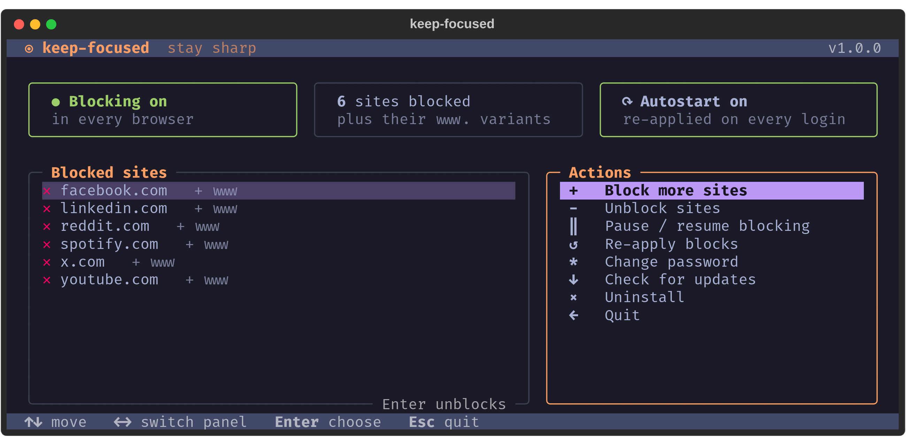

# keep-focused

Block distracting websites **system-wide** on Debian — in every browser — behind a password you can't bypass on a whim.



- **Every browser** — blocks via `/etc/hosts`, plus a `dnsmasq` wildcard so any subdomain is blocked too
- **Password-protected** — unblocking, pausing or uninstalling needs a ≥20-character password (PBKDF2-SHA256)
- **Survives reboots** — a `systemd` service re-applies blocks on every boot
- **No sudo or pip to install** — `sudo` is only asked for when `/etc/hosts` is edited

## Install

```bash
curl -fsSL https://raw.githubusercontent.com/xweinp/keep-focused/main/install.sh | bash
```

Installs to `~/.local/share/keep-focused` with a launcher at `~/.local/bin/keep-focused`. Needs `python3 >= 3.9`.

## Use

```bash
keep-focused
```

The first run walks you through picking sites and setting a password. After that: `↑↓` move, `←→` switch panel, `Enter` choose, `Esc` back/quit. Adding sites never needs the password.

Without [Textual](https://textual.textualize.io) installed, a simpler line-based menu is used.

### Commands

For scripting. Everything except `status`, `list` and `update` asks for the password.

```bash
keep-focused status
keep-focused block youtube.com reddit.com
keep-focused unblock spotify.com
keep-focused disable | enable
keep-focused passwd
keep-focused update [--check|--force]
keep-focused uninstall
```

## How it works

- `/etc/hosts` gets a `# BEGIN keep-focused` … `# END keep-focused` block mapping each site and its `www.` to `127.0.0.1` / `::1`.
- If `dnsmasq` is present, `/etc/dnsmasq.d/keep-focused.conf` blocks every subdomain (`a.b.site.com`) but not look-alikes (`notsite.com`).
- Config lives in `~/.config/keep-focused/config.json` (mode 0600).

## Development

```bash
./run-tests.sh
```

Override paths for safe manual testing with `KEEP_FOCUSED_HOSTS`, `KEEP_FOCUSED_CONFIG`, `KEEP_FOCUSED_SERVICE` and `KEEP_FOCUSED_DNSMASQ`.

## License

MIT
